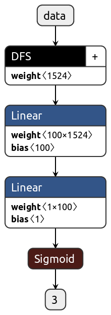

# Deep Feature Selection

This repository contains implementation of `Deep Feature Selection` algorithm on `PyTorch` from this [article](https://pdfs.semanticscholar.org/ac2a/c075773cc936a206c3ebb2339376d586bcbd.pdf)

Data was taken from [here](https://drive.google.com/drive/folders/1Dk6pd_zgDYZBW-4isEQUnpw9IGIQHBW6?usp=sharing)

In the `.ipynb` file also have done comparision Neural Network approach with `RandomForestClassifier` from `scikit-learn`.

Simple Neural Network approach consist of 3 layers: `DFS` and two Linear:

Trained model is saved and [accessible for use](model.pth)